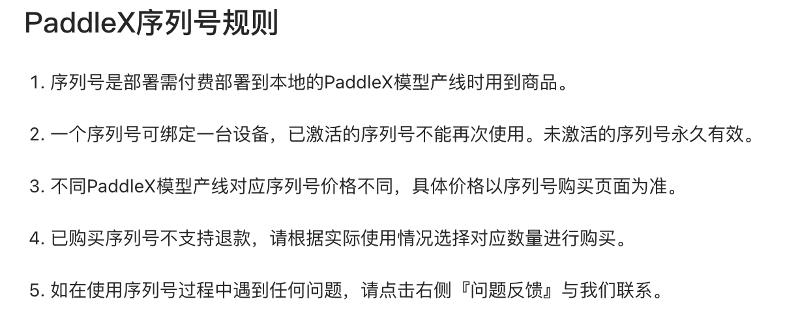

# wukong.paddlex 环境搭建

更新记录：

- 2025/2/19，创建文档；
- 2025/2/21，补充源码编译流程。
- 2025/3/10，补充 paddlex 插件安装

[https://www.paddlepaddle.org.cn/packages/stable/cu118/paddlepaddle-gpu/](https://www.paddlepaddle.org.cn/packages/stable/cu118/paddlepaddle-gpu/)

# 概述

## 快速入手

> [!TIP]
> 按照以下需要查看相应的章节内容：

1. 只需要在 Nvidia Jetson Xavier NX 上，安装 paddlepaddle, 以及 paddlex 的 wheel 软件包。直接看《Jetson NX 新环境安装》。
2. 在第一种的基础上，需要支持 paddlex 的插件模式。看《Jetson NX PaddleX 插件》
3. 进行源码编译，可以从头开始。

经过在 X86 服务器上的测试验证，paddlex 可以用来做图像识别的产线。

安装部署有两种方式：一是本地部署；二是 Docker 部署。

## 版本对应

关于 PaddlePaddle 与 PaddleX 的版本组合关系：

- Paddlepaddle 2.x

  - PaddlePaddle 2.6.2 支持的 CUDA 版本为 10.2/11.2/11.6/11.7。
- PaddlePaddle 3.0 版支持更高 CUDA 版本，包括 11.8 和 12.3，已经不支持 CUDA 10.2

先用本地安装部署验证，然后再使用 Docker 作为可选项。

## PaddleX 收费



# Jetson NX 新环境安装

> [!TIP]

1. 从百度网盘下载文件（两个 wheel 软件包，一张测试图片）；
2. 按照下面的指令：升级工具；安装 whl 包，可能会提示缺少 onnx，然后补充安装；
3. 运行 paddlex 可能会出现 np.bool 报错，可以修改文件（workaround): 增加 np.bool=np.bool_临时解决。
4. 然后再执行 paddlex pipeline 命令，检查结果。

wheel 包下载：

链接: [https://pan.baidu.com/s/1Baw19iZv5N_9kih4i8vtbA?pwd=geaa](https://pan.baidu.com/s/1Baw19iZv5N_9kih4i8vtbA?pwd=geaa) 提取码: geaa

```bash
# 下载两个wheel软件包
pythond -m pip install --upgrade pip setuptools wheel

pip install paddlepaddle_gpu-3.0.0-cp38-cp38-linux_aarch64.whl
pip install paddlex-d.0.0rc0-py3-none-any.whl

#可能需要安装的包
pip install onnx

# 增加np.bool
sudo vi /usr/lib/python3/dist-packages/pandas/util/testing.py

# 在import numpy as np 28行后增加新的一行如下：

np.bool = np.bool_
#保存退出

# 验证，事先上传图片QR-TEST.png到指定的目录
paddlex --pipeline OCR --input QR-TEST.png --use_doc_orientation_classify False --use_doc_unwarping False --use_textline_orientation False --device gpu:0 --save_path ./output1
```

## PaddleX 高性能推理

```python
from paddlex import create_pipeline

pipeline = create_pipeline(
    pipeline="image_classification",
    use_hpip=True,
    hpi_params={"serial_number": "{序列号}"},
)
```

# Jetson NX PaddleX 插件安装

## 安装 paddle-gpu wheel

```
sudo apt update
sudo apt install python-is-python3
# venv
sudo apt install python3-venv
python -m venv paddlex

# 下载两个wheel软件包
python3 -m pip install --upgrade pip setuptools wheel testresources

pip install paddlepaddle_gpu-3.0.0-cp38-cp38-linux_aarch64.whl

# ccache
git clone https://github.com/ccache/ccache.git
cd ccache
mkdir build
cd build
cmake -D CMAKE_BUILD_TYPE=Release ..
make
make install

#可能需要安装的包
pip install onnx

# 增加np.bool
sudo vi /usr/lib/python3/dist-packages/pandas/util/testing.py

# 在import numpy as np 28行后增加
np.bool = np.bool_
#保存退出
```

## PaddleX 插件安装

```
git clone https://github.com/PaddlePaddle/PaddleX.git
# 修改requirements.txt
# 去掉opencv, scikit-learn
# 手工安装scikit-learn
wget https://files.pythonhosted.org/packages/35/ed/4bac8cc77baa335f31e1ea7dd91fc3b0793df755192aa384c7ca4dee4841/scikit_learn-0.24.2-cp38-cp38-manylinux2014_aarch64.whl
pip install scikit_learn-0.24.2-cp38-cp38-manylinux2014_aarch64.whl

pip install build
pip install -e .
paddlex --install PaddleOCR PaddleClas PaddleDetection

# 修改 PaddleX/paddlex/repo_manager/repos/PaddleNLP/requirements.txt
# 注释掉 #tool_helpers ; platform_system == "Linux"
# 重新运行
paddlex --install PaddleOCR PaddleClas PaddleDetection
# 提示是否删掉下载的内容，不用删掉(n)，
```

# 基础环境安装

采用 SDK Manager 安装，Jetpack 5.1.4

- 保留 cuda 11.4 版本；
- ~~升级 gcc-11~~，但还是用系统自带的 gcc-9；

参见《[WK-E1500 边缘设备预装 SOP](https://broadvideo.feishu.cn/docx/B8uudQanboSPVDxYgqOcXDKin1e?from=from_copylink)》

PaddlePaddle 源码编译参见《[OCR 选型使用](https://broadvideo.feishu.cn/docx/ThRadWzqLoOHW3x0osEcgztAngc?from=from_copylink)》

主要步骤

- 升级 cmake
- paddlepaddle 编译([https://www.paddlepaddle.org.cn/documentation/docs/en/install/compile/fromsource_en.html](https://www.paddlepaddle.org.cn/documentation/docs/en/install/compile/fromsource_en.html))

检查系统信息

```bash
uname -m && cat /etc/*release
apt update
apt install -y bzip2 make

# Python
find `dirname $(dirname $(which python3))` -name "libpython3.8.so"
#/usr/lib/aarch64-linux-gnu/libpython3.8.so
#/usr/lib/python3.8/config-3.8-aarch64-linux-gnu/libpython3.8.so
export PYTHON_LIBRARY=/usr/lib/aarch64-linux-gnu

find `dirname $(dirname $(which python3))`/include -name "python3.8"
#/usr/include/aarch64-linux-gnu/python3.8
#/usr/include/python3.8
export PYTHON_INCLUDE_DIRS=/usr/include/aarch64-linux-gnu
export PATH=/usr/bin/:$PATH
```

```bash
ssh-keygen -R 192.168.1.101

sudo apt install curl wget
sudo apt install python3-pip
python3 -m pip install --upgrade pip setuptools
# global
$ python3 -m pip install --upgrade pip setuptools
Collecting pip
  Downloading pip-25.0.1-py3-none-any.whl (1.8 MB)
     |████████████████████████████████| 1.8 MB 1.3 MB/s 
Collecting setuptools
  Downloading setuptools-75.3.0-py3-none-any.whl (1.3 MB)
     |████████████████████████████████| 1.3 MB 875 kB/s 
ERROR: launchpadlib 1.10.13 requires testresources, which is not installed.
Installing collected packages: pip, setuptools
  WARNING: The scripts pip, pip3 and pip3.8 are installed in '/home/nvidia/.local/bin' which is not on PATH.
  Consider adding this directory to PATH or, if you prefer to suppress this warning, use --no-warn-script-location.
Successfully installed pip-25.0.1 setuptools-75.3.0
```

Cmake （3.18 required）

```bash
cmake --version
# 3.16. 系统要求3.18
sudo apt-get remove cmake
wget https://github.com/Kitware/CMake/releases/download/v3.18.6/cmake-3.18.6.tar.gz
tar -xzvf cmake-3.18.6.tar.gz
#wget https://github.com/Kitware/CMake/releases/download/v3.31.5/cmake-3.31.5.tar.gz
#tar -xzvf cmake-3.31.5.tar.gz
cd cmake-3.31.5
chmod 777 ./configure
sudo apt install libssl-dev
./configure
# 设置c-core，提升速度？
uname -n 102400
make -j$(nproc)
sudo make install
cmake --version
```

GCC-11（未使用，缺省为系统自带的 gcc-9）

```bash
sudo apt update
sudo apt install software-properties-common
sudo add-apt-repository ppa:ubuntu-toolchain-r/test
sudo apt update
sudo apt install gcc-11 g++-11 -y
sudo update-alternatives --install /usr/bin/gcc gcc /usr/bin/gcc-11 70 --slave /usr/bin/g++ g++ /usr/bin/g++-11
sudo update-alternatives --install /usr/bin/gcc gcc /usr/bin/gcc-9 50 --slave /usr/bin/g++ g++ /usr/bin/g++-9
sudo update-alternatives --config gcc
gcc --version
```

# paddlepaddle 编译

## 3.0.0 正式版本

2025/4/16

```bash
git clone https://github.com/PaddlePaddle/Paddle.git
cd Paddle

$ git branch
  develop
  release/3.0-beta2
* release/3.0-rc

# latest version: 3.0-rc
# choose release: v3.0.0-beta-2
git branch -r # remote
#git checkout release/v3.0.0-beta0
git checkout release/3.0-rc
# git checkout tags/v2.6.2

# 升级pip
sudo apt install python3-pip
python3 -m pip install --upgrade pip
# /home/nvidia/.local/bin add to .bashrc
pip3 install patchelf

# 删除python/requirements.txt中的opencv-python, Jetpack自带的更新。

pip install httpx
pip install setuptools testresources

sudo fallocate -l 5G /var/swapfile
sudo chmod 600 /var/swapfile
sudo mkswap /var/swapfile
sudo swapon /var/swapfile
sudo bash -c 'echo "/var/swapfile swap swap defaults 0 0" >> /etc/fstab'

sudo nvpmodel -m 0 && sudo jetson_clocks #(max power mode)
ulimit -n 102400

git submodule sync --recursive
git submodule update --init --recursive

sudo apt-get install gcc-8 g++-8
sudo update-alternatives --install /usr/bin/gcc gcc /usr/bin/gcc-8 40
sudo update-alternatives --install /usr/bin/gcc gcc /usr/bin/gcc-9 50
sudo update-alternatives --install /usr/bin/gcc gcc /usr/bin/gcc-11 70

sudo update-alternatives --install /usr/bin/g++ g++ /usr/bin/g++-8 40
sudo update-alternatives --install /usr/bin/g++ g++ /usr/bin/g++-9 50
sudo update-alternatives --install /usr/bin/g++ g++ /usr/bin/g++-11 70

sudo update-alternatives --config gcc
sudo update-alternatives --config g++

export PYTHONPATH=/usr/lib/python3.8:/usr/include/python3.8:$PYTHONPATH

mkdir build_cuda && cd build_cuda

cmake ..  -DWITH_CONTRIB=OFF -DCMAKE_BUILD_TYPE=Release -DWITH_TESTING=OFF -DWITH_MKL=OFF -DWITH_MKLDNN=OFF -DWITH_AVX=OFF -DWITH_GPU=ON -DWITH_PYTHON=ON -DPY_VERSION=3.8 -DWITH_XBYAK=OFF -DWITH_NCCL=OFF -DWITH_NV_JETSON=ON -DWITH_TENSORRT=ON -DCUDA_ARCH_NAME=Auto -DTENSORRT_ROOT=/usr -DTENSORRT_INCLUDE_DIRS=/usr/include/aarch64-linux-gnu -DTENSORRT_LIBRARY=/usr/lib/aarch64-linux-gnu -DON_INFER=ON -DPY_NUMPY=/usr/lib/python3/dist-packages/numpy -DPY_WHEEL=/usr/lib/python3/dist-packages/wheel -DPY_GOOGLE.PROTOBUF=/home/nvidia/.local/lib/python3.8/site-packages/google/protobuf -DPYTHON_EXECUTABLE=/usr/bin/python3 -DCMAKE_CXX_FLAGS="-Wno-error=class-memaccess" -DWITH_EAGER=ON -DWITH_ARM=ON -Wno-dev -DPADDLE_VERSION=3.0.0

# 编译选项的设置，只在第一次 cmake 的时候有效。如果之后想要重新设置，推荐清理整个编译目录（ rm -rf ）后，再指定。

# -DPY_PIP=/home/nvidia/.local/bin/pip
# TensorRT_root default is /usr/
# NCCL=OFF
# make -j4 提示缺少内存，8G内存，4core 20W
# 添加swap空间

pip install -r python/requirements.txt

make -j4 | tee /home/nvidia/build-paddle-0226.txt
make -j2 | tee /home/nvidia/build-paddle-0222.txt
make | tee /home/nvidia/build-paddle-0221.txt

# install .whl ？？？
pip3 install python/dist/paddlepaddle_gpu-2.6.1-cp38-cp38-linux_aarch64.whl

import paddle
print(paddle.__version__)
```

## 3.0-rc

选择了 3.0-beta2，（测试了 3.0-rc，试验过不行）

参考资料：[https://akarsh1995.medium.com/compile-paddle-deep-learning-framework-on-jetson-xavier-nx-5d6a4f9aa38b](https://akarsh1995.medium.com/compile-paddle-deep-learning-framework-on-jetson-xavier-nx-5d6a4f9aa38b)

```bash
git clone https://github.com/PaddlePaddle/Paddle.git
cd Paddle

$ git branch
  develop
  release/3.0-beta2
* release/3.0-rc

# latest version: 3.0-rc
# choose release: v3.0.0-beta-2
git branch -r # remote
#git checkout release/v3.0.0-beta0
git checkout release/3.0-rc
# git checkout tags/v2.6.2

# 升级pip
sudo apt install python3-pip
python3 -m pip install --upgrade pip
# /home/nvidia/.local/bin add to .bashrc
pip3 install patchelf

# 删除python/requirements.txt中的opencv-python, Jetpack自带的更新。

pip install httpx
pip install setuptools testresources

sudo fallocate -l 5G /var/swapfile
sudo chmod 600 /var/swapfile
sudo mkswap /var/swapfile
sudo swapon /var/swapfile
sudo bash -c 'echo "/var/swapfile swap swap defaults 0 0" >> /etc/fstab'

sudo nvpmodel -m 0 && sudo jetson_clocks #(max power mode)
ulimit -n 102400

git submodule sync --recursive
git submodule update --init --recursive

sudo apt-get install gcc-8 g++-8
sudo update-alternatives --install /usr/bin/gcc gcc /usr/bin/gcc-8 40
sudo update-alternatives --install /usr/bin/gcc gcc /usr/bin/gcc-9 50
sudo update-alternatives --install /usr/bin/gcc gcc /usr/bin/gcc-11 70

sudo update-alternatives --install /usr/bin/g++ g++ /usr/bin/g++-8 40
sudo update-alternatives --install /usr/bin/g++ g++ /usr/bin/g++-9 50
sudo update-alternatives --install /usr/bin/g++ g++ /usr/bin/g++-11 70

sudo update-alternatives --config gcc
sudo update-alternatives --config g++

export PYTHONPATH=/usr/lib/python3.8:/usr/include/python3.8:$PYTHONPATH

mkdir build_cuda && cd build_cuda

cmake ..  -DWITH_CONTRIB=OFF -DCMAKE_BUILD_TYPE=Release -DWITH_TESTING=OFF -DWITH_MKL=OFF -DWITH_MKLDNN=OFF -DWITH_AVX=OFF -DWITH_GPU=ON -DWITH_PYTHON=ON -DPY_VERSION=3.8 -DWITH_XBYAK=OFF -DWITH_NCCL=OFF -DWITH_NV_JETSON=ON -DWITH_TENSORRT=ON -DCUDA_ARCH_NAME=Auto -DTENSORRT_ROOT=/usr -DTENSORRT_INCLUDE_DIRS=/usr/include/aarch64-linux-gnu -DTENSORRT_LIBRARY=/usr/lib/aarch64-linux-gnu -DON_INFER=ON -DPY_NUMPY=/usr/lib/python3/dist-packages/numpy -DPY_WHEEL=/usr/lib/python3/dist-packages/wheel -DPY_GOOGLE.PROTOBUF=/home/nvidia/.local/lib/python3.8/site-packages/google/protobuf -DPYTHON_EXECUTABLE=/usr/bin/python3 -DCMAKE_CXX_FLAGS="-Wno-error=class-memaccess" -DWITH_EAGER=ON -DWITH_ARM=ON -Wno-dev -DPADDLE_VERSION=3.0.0

# 编译选项的设置，只在第一次 cmake 的时候有效。如果之后想要重新设置，推荐清理整个编译目录（ rm -rf ）后，再指定。

# -DPY_PIP=/home/nvidia/.local/bin/pip
# TensorRT_root default is /usr/
# NCCL=OFF
# make -j4 提示缺少内存，8G内存，4core 20W
# 添加swap空间

pip install -r python/requirements.txt

make -j4 | tee /home/nvidia/build-paddle-0226.txt
make -j2 | tee /home/nvidia/build-paddle-0222.txt
make | tee /home/nvidia/build-paddle-0221.txt

# install .whl ？？？
pip3 install python/dist/paddlepaddle_gpu-2.6.1-cp38-cp38-linux_aarch64.whl

import paddle
print(paddle.__version__)
```

```python
# 检查安装后的版本以及GPU情况
import paddle
print(paddle.__version__)

import paddle
paddle.set_device('gpu:0')  # 明确指定 GPU 设备
x = paddle.ones([2, 3], dtype='float32')
y = x * 2
print(y)

# TensorRT
from paddle.inference import Config, create_predictor
config = Config("path_to_model/model.pdmodel", "path_to_model/model.pdiparams")
config.enable_use_gpu(100, 0)  # 初始化 GPU，100MB 内存，设备 ID 0
config.enable_tensorrt_engine(workspace_size=1 << 30, max_batch_size=1, min_subgraph_size=3)
predictor = create_predictor(config)
print("TensorRT enabled successfully")

# CUDA, CuDNN
nvcc --version
cat /usr/include/cudnn_version.h | grep CUDNN_MAJOR -A 2
dpkg -l | grep tensorrt
```

存在的告警

- openblas 版本高 0.3.18 vs 0.3.7
- gcc 版本高，gcc-9 vs gcc-8

## 检查 PaddlePaddle（编译后）

[https://github.com/PaddlePaddle/Paddle/issues/27402](https://github.com/PaddlePaddle/Paddle/issues/27402)

```bash
python3 -c "import paddle; print(paddle.__version__)"
# 2.6.2

dpkg -l | grep opencv
```

```bash
$ dpkg -l | grep opencv
ii  libgstreamer-**opencv**1.0-0:arm64             1.16.3-0ubuntu1.1                     arm64        GStreamer OpenCV libraries
ii  lib**opencv**                                  4.5.4-8-g3e4c170df4                   arm64        Open Computer Vision Library
ii  lib**opencv**-calib3d4.2:arm64                 4.2.0+dfsg-5                          arm64        computer vision Camera Calibration library
ii  lib**opencv**-contrib4.2:arm64                 4.2.0+dfsg-5                          arm64        computer vision contrlib library
ii  lib**opencv**-core4.2:arm64                    4.2.0+dfsg-5                          arm64        computer vision core library
ii  lib**opencv**-dev                              4.5.4-8-g3e4c170df4                   arm64        Open Computer Vision Library
ii  lib**opencv**-dnn4.2:arm64                     4.2.0+dfsg-5                          arm64        computer vision Deep neural network module
ii  lib**opencv**-features2d4.2:arm64              4.2.0+dfsg-5                          arm64        computer vision Feature Detection and Descriptor Extraction library
ii  lib**opencv**-flann4.2:arm64                   4.2.0+dfsg-5                          arm64        computer vision Clustering and Search in Multi-Dimensional spaces library
ii  lib**opencv**-highgui4.2:arm64                 4.2.0+dfsg-5                          arm64        computer vision High-level GUI and Media I/O library
ii  lib**opencv**-imgcodecs4.2:arm64               4.2.0+dfsg-5                          arm64        computer vision Image Codecs library
ii  lib**opencv**-imgproc4.2:arm64                 4.2.0+dfsg-5                          arm64        computer vision Image Processing library
ii  lib**opencv**-ml4.2:arm64                      4.2.0+dfsg-5                          arm64        computer vision Machine Learning library
ii  lib**opencv**-objdetect4.2:arm64               4.2.0+dfsg-5                          arm64        computer vision Object Detection library
ii  lib**opencv**-photo4.2:arm64                   4.2.0+dfsg-5                          arm64        computer vision computational photography library
ii  lib**opencv**-python                           4.5.4-8-g3e4c170df4                   arm64        Open Computer Vision Library
ii  lib**opencv**-samples                          4.5.4-8-g3e4c170df4                   arm64        Open Computer Vision Library
ii  lib**opencv**-shape4.2:arm64                   4.2.0+dfsg-5                          arm64        computer vision shape descriptors and matchers library
ii  lib**opencv**-stitching4.2:arm64               4.2.0+dfsg-5                          arm64        computer vision image stitching library
ii  lib**opencv**-superres4.2:arm64                4.2.0+dfsg-5                          arm64        computer vision Super Resolution library
ii  lib**opencv**-video4.2:arm64                   4.2.0+dfsg-5                          arm64        computer vision Video analysis library
ii  lib**opencv**-videoio4.2:arm64                 4.2.0+dfsg-5                          arm64        computer vision Video I/O library
ii  lib**opencv**-videostab4.2:arm64               4.2.0+dfsg-5                          arm64        computer vision video stabilization library
ii  lib**opencv**-viz4.2:arm64                     4.2.0+dfsg-5                          arm64        computer vision 3D data visualization library
ii  lib**opencv**4.2-java                          4.2.0+dfsg-5                          all          Java bindings for the computer vision library
ii  lib**opencv**4.2-jni                           4.2.0+dfsg-5                          arm64        Java jni library for the computer vision library
ii  **opencv**-licenses                            4.5.4-8-g3e4c170df4                   arm64        Open Computer Vision Library
```

```python
import cv2
print(cv2.__version__)
#4.5.5
```

```bash
echo $LD_LIBRARY_PATH
# /usr/local/cuda-11.8/compat:
```

# PaddleX 编译

[https://paddlexdocs.readthedocs.io/en/stable/tutorials/deploy/deploy_server/deploy_python.html](https://paddlexdocs.readthedocs.io/en/stable/tutorials/deploy/deploy_server/deploy_python.html)

## 检查环境信息

```bash
git clone https://github.com/PaddlePaddle/PaddleX.git
cd PaddleX
git checkout release/3.0-rc

# 修改requirements.txt中的内容
# 隐含掉opencv, paddlepaddle-gpu
```

```bash
pip install -r requirements.txt 2>&1 | tee ~/paddlex-requirements_0302.log

# 手工安装scikit_learn，去掉requirements.txt一行，版本没有aarch64

wget https://files.pythonhosted.org/packages/35/ed/4bac8cc77baa335f31e1ea7dd91fc3b0793df755192aa384c7ca4dee4841/scikit_learn-0.24.2-cp38-cp38-manylinux2014_aarch64.whl
pip install scikit_learn-0.24.2-cp38-cp38-manylinux2014_aarch64.whl

# 去掉setup.py中的内容
# opencv, scikit_learn

python3 -m pip install . --user

python3 -m pip install build
python3 -m build

python3 -m pip install --upgrade pip setuptools wheel
# wheel pkg installed
python3 setup.py sdist bdist_wheel
# 生成了两个文件 wheel & tar.gz

#pip install --user . 2>&1 | tee paddlex_install.log
#python setup.py install 2>&1 | tee paddlex_install0302.log

# 报错的地方处理有效 https://stackoverflow.com/questions/74893742/how-to-solve-attributeerror-module-numpy-has-no-attribute-bool
import numpy as np
np.bool = np.bool_
```

## Pipdeptree check

```bash
sudo apt update
pip install pipdeptree

pipdeptree -p opencv-python -r
Warning!!! Duplicate package metadata found:
"/usr/lib/python3/dist-packages"
  pip                              20.0.2           (using 25.0.1, "/usr/local/lib/python3.8/dist-packages")
  idna                             2.8              (using 3.4, "/usr/local/lib/python3.8/dist-packages/idna-3.4-py3.8.egg")
  requests                         2.22.0           (using 2.28.2, "/usr/local/lib/python3.8/dist-packages/requests-2.28.2-py3.8.egg")
  certifi                          2019.11.28       (using 2022.12.7, "/usr/local/lib/python3.8/dist-packages/certifi-2022.12.7-py3.8.egg")
  urllib3                          1.25.8           (using 1.26.14, "/usr/local/lib/python3.8/dist-packages/urllib3-1.26.14-py3.8.egg")
NOTE: This warning isn't a failure warning.
------------------------------------------------------------------------
Warning!!! Possibly conflicting dependencies found:
* PyGObject==3.36.0
 - pycairo [required: >=1.11.1, installed: ?]
------------------------------------------------------------------------
opencv-python==4.11.0.86
├── paddleslim==2.2.1 [requires: opencv-python]
│   └── paddlex==2.1.0 [requires: paddleslim==2.2.1]
└── paddlex==2.1.0 [requires: opencv-python]
```
