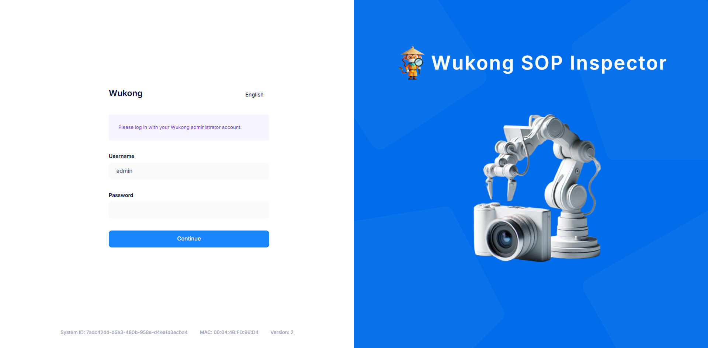
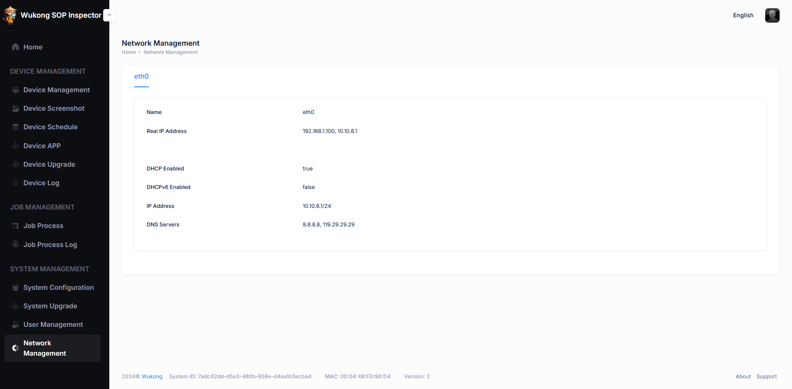

# 悟空 SOP 作业检查系统手册

> 🖼 在理想的最美好世界中，一切都是为最美好的目的而设。 —— 伏尔泰

## 一、系统组成

- 作业主机 1 台
- 作业终端 1-3 台
- 摄像头 1-3 台

## 二、系统安装

### 2.1   作业主机硬件连接

把作业主机联网并且上电开机

- 通过网线，连接到外部路由器，用于同步最新时间
- 连接电源线上电，作业主机启动

### 2.2   作业终端硬件连接

依次把作业终端连接，并且上电开机

- 作业终端通过 HDMI 线连接显示器
- USB 接口连接相机（需要连接 USB3.0）
- USB 接口连接鼠标
- USB 接口连接键盘（可选）
- 把网线连接作业终端和作业主机
- 连接电源并上电

### 2.3  作业终端相机设置

- 在不影响工位人工作业的情况下，相机安装在作业动作范围外。
- 视野要求：物距 500~800mm，视野 500x400mm。

当前相机的规格：

- 800 万像素工业相机及配套镜头
- 3840*2160 像素，像元 2um，靶面尺寸 1/1.8”
- 工作距离:555mm
- 视野:711x400mm

### 2.3   作业主机开机

用 PC 电脑，通过网线连接主机，以太网设置为 DHCP。通过 Chrome 浏览器（或者 Microsoft Edge，Firefox 等浏览器）访问首页：[http://10.10.8.1](http://10.10.8.1)。当出现以下界面时，则访问成功。

在此界面可以切换语言。

进入 Device Management 菜单，选择一个 Unbound 的终端，记录 Terminal Code。

### 2.4   作业终端开机激活

作业终端开机后，自动进入作业桌面。

进入桌面后，点击设置，进入设置界面，检查服务器地址是否配置为 [http://10.10.8.1](http://10.10.8.1)

在终端编码处，输入作业主机上记录的 Terminal Code，点击激活。

如果成功，则硬件终端激活成功。

返回作业终端桌面，检查摄像头是否能正常显示实时画面，请进设置界面进行相关摄像头的配置。

### 2.5   注意事项

- 作业主机的默认内部 IP 地址是 10.10.8.1，作业终端开机后能通过主机的 DHCP，动态取得 10.10.8.*的 ip 地址。
- 启动顺序需要保证，主机先启动完成，作业终端或 PC 电脑才能动态获得 IP 地址。如果连不上主机，则可以尝试插拔网线，或者重启作业终端以及 PC 电脑。
- 如果浏览器无法访问作业主机的 [http://10.10.8.1](http://10.10.8.1)，请检查本机以太网是否配置为 DHCP，并且本机动态获得的 IP 地址是否为 10.10.8.*网段。以及尝试 ping 10.10.8.1 是否成功。
- 浏览器使用用户名和密码，登录作业主机时，如果提示 502 错误，则主机未启动成功。
- 主机建议通过网线连接到外部路由器，从而可以获取外部 NTP 服务器，进行时间同步。否则可能会出现时间不同步的情况。

## 三、作业配置

### 3.1   获取作业终端截图

此步骤获得的作业终端截图，是为制作作业流程做准备。请通过更换摄像头下的实物，来获取不同的作业截图。

进入 Device Screenshot 菜单。

点击 Remote Upload，选择对应的作业终端，提交后，等待 30 秒左右，刷新界面可以看到终端上传的实时截图。

- 作业流程 Job Process，可以包含多个作业指引 Job Instruction
- 作业指引 Job Instruction，包含多个作业项 Job Item
- 作业项 Job Item，包含一张主图像，一个基准搜索区，一个基准点，若干检测点。

进入 Job Process 菜单。

点击 Add Job Process 按键。选择对应的作业终端，以及相关作业流程参数后提交。

选择对应的作业流程，点击 Name 对应的 Link，或者点击"Design Job Process"，进入作业流程制作界面。

点击 Add Job Instruction，创建 Job Instruction。

在对应的 Job Instruction 下点击 Add Job Item，创建 Job Item

点击对应的 Job Item 图像，或者点击 Design Job Item 按键，进入 Job Item 的设计界面。

分别点击并创建 Base Search Area，Base Point，Check Point

完成作业设计后，点击 Publish Job Process，作业流程将会同步到作业终端。

## 四、作业执行

### 4.1   作业同步

作业从主机同步到终端，有 2 种方式，一种是从作业主机上远程同步，一种是在作业终端上主动获取。

从作业主机上远程同步：在 Job Process 菜单，点击对应 Job Process 的 Sync 按键。

或者在 Device Management 菜单，点击对应 Device 的 Sync Job Process 按键。

从作业终端上主动同步：进入终端上的设置界面，进入数据管理菜单，点击获取数据。

### 4.2   作业运行

在作业终端上点击“开始”，进行作业。

### 4.3   注意事项

- 作业终端桌面上显示的是本终端的默认作业，如果想更改默认作业，请到作业主机上修改。
- 作业运行时，需要先在基准搜索区中，搜索基准点，才能开始检测。如果基准点搜索不到，会一直等待到基准点出现。基准点搜索到后，检测点再进行检测，并进行时长的判断，超时后检测项会发生 NG。默认情况下流程会中断退出。
- 在循环作业完成一次作业时，需要重新摆放下一个物件，才会自动执行下一次作业。如果不再进行作业，需要点击取消。

## 五、作业主机功能说明

### 5.1   终端管理

在 Device Management 界面，可以对终端进行绑定、解绑、同步、编辑等操作。

在 Device Screenshot 界面，可以对终端进行远程截图操作。

在 Device Schedule 界面，可以管理终端的开机、关机等定时任务。

在 Device App 界面，可以管理终端的软件版本。

在 Device Upgrade 界面，可以管理终端的升级策略。

在 Device Log 界面，可以收集终端的运行日志。

### 5.2   作业管理

在 Job Process 界面，可以管理终端的作业流程。

在 Job Process Log 界面，可以管理终端的作业流程记录。

### 5.3   系统管理

在 System Configuration 界面，可以进行系统的参数配置。

在 System Upgrade 界面，可以进行作业主机的升级。

在 User Management 界面，可以进行用户的管理。

在 Network Management 界面，可以查看系统的网络配置。

